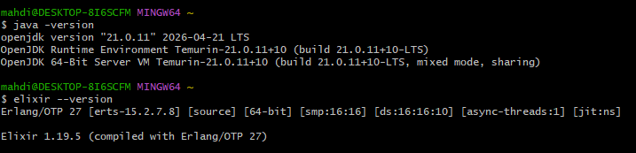
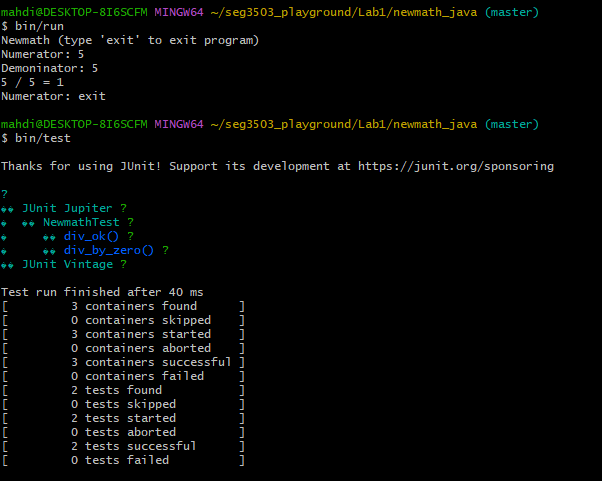
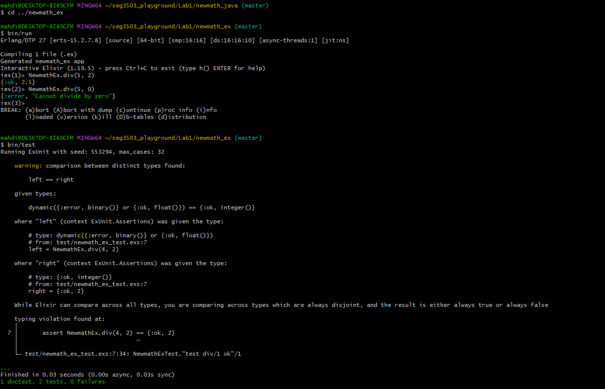

# seg3503_playground

| Champ      | Valeur        |
|------------|---------------|
| Cours      | SEG 3503      |
| Date       | Été 2026      |
| Étudiant   | Mahdi Hassoun |
| Courriel   | mhass082@uottawa.ca |
| GitHub     | https://github.com/mahdihass28/seg3503_playground |

---

## Laboratoire 1

Les deux projets se trouvent dans `Lab1/`. Exécutez toutes les commandes depuis le dossier de chaque projet en utilisant **Git Bash** (Windows) ou un terminal standard (Mac/Linux).

### Java — newmath_java

**Prérequis :** Java 21+

```bash
cd Lab1/newmath_java

# Lancer le programme de division interactif
bin/run

# Lancer les tests JUnit
bin/test
```

**Résultat de bin/run :**
```
Newmath (type 'exit' to exit program)
Numerator: 5
Demoninator: 5
5 / 5 = 1
Numerator: exit
```

**Résultat de bin/test :**
```
Thanks for using JUnit! Support its development at https://junit.org/sponsoring

├─ JUnit Jupiter ✔
│  └─ NewmathTest ✔
│     ├─ div_ok() ✔
│     └─ div_by_zero() ✔
└─ JUnit Vintage ✔

Test run finished after 40 ms
[         3 containers found      ]
[         0 containers skipped    ]
[         3 containers started    ]
[         0 containers aborted    ]
[         3 containers successful ]
[         0 containers failed     ]
[         2 tests found           ]
[         0 tests skipped         ]
[         2 tests started         ]
[         0 tests aborted         ]
[         2 tests successful      ]
[         0 tests failed          ]
```

---

### Elixir — newmath_ex

**Prérequis :** Elixir 1.14+ avec Erlang/OTP 25+

```bash
cd Lab1/newmath_ex

# Lancer une session IEx interactive
bin/run
# Puis dans IEx :
#   iex(1)> NewmathEx.div(5, 2)
#   {:ok, 2.5}
#   iex(2)> NewmathEx.div(5, 0)
#   {:error, "Cannot divide by zero"}

# Lancer les tests ExUnit
bin/test
```

**Résultat de bin/test :**
```
...
Finished in 0.01 seconds (0.00s async, 0.01s sync)
1 doctest, 2 tests, 0 failures
```

---

## Captures d'écran

### Version Java & Version Elixir


### Java — exécution & tests


### Elixir — exécution & tests

